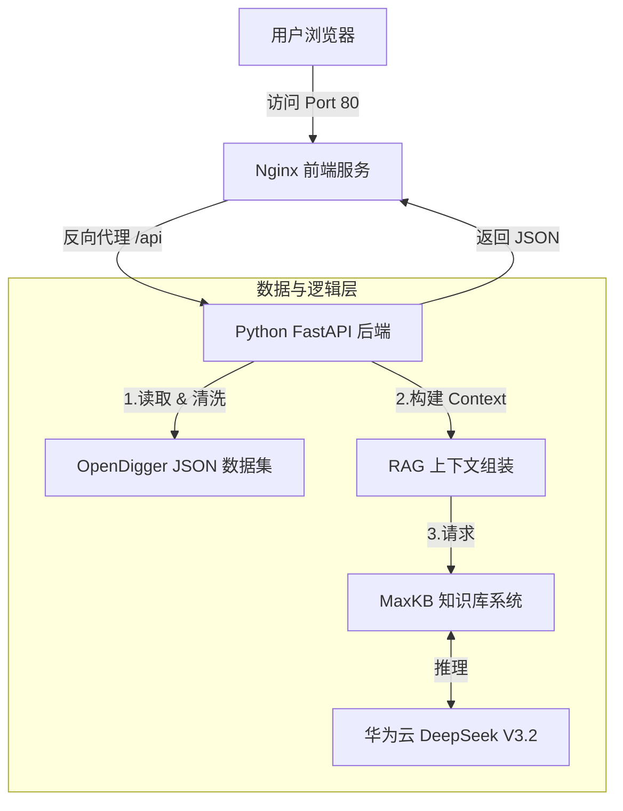

# 🚀 OpenRank Insight | 开源项目智能决策大屏

> **基于 OpenDigger 全域数据与 MaxKB RAG 架构的下一代开源生态洞察平台**

OpenRank Insight 是一个为开发者、项目管理者和开源投资者打造的数据可视化与 AI 辅助决策工具。它摒弃了枯燥的 JSON 数据，通过赛博朋克风格的仪表盘和智能 AI 分析师，让开源项目的健康度、影响力和演进趋势一目了然。

---

## ✨ 核心亮点 (Key Features)

### 1. 🧠 RAG 智能分析架构 (Powered by MaxKB)
- **拒绝幻觉**：不同于通用大模型，本系统基于 **MaxKB** 构建了 RAG（检索增强生成）流程。
- **数据闭环**：后端实时读取 **OpenDigger** 的 `OpenRank`、`Activity`、`Bus Factor` 等核心指标，构建精准的上下文 (Context) 投喂给 **DeepSeek V3.2**，确保 AI 的每一次回答都有数据支撑。

### 2. ⚔️ 沉浸式 PK 对战模式
- **双子星对比**：一键开启 PK 模式，选择两个开源项目（如 Elasticsearch vs AdGuard）。
- **五维雷达图**：自动生成包含活跃度、影响力、协作力、成长性、响应力的雷达对比图。
- **AI 裁判**：AI 分析师会自动切换视角，对两个项目的生态优劣进行深度对比。

### 3. 🔮 AI 趋势预测
- **算法加持**：在历史折线图的基础上，引入线性回归算法，绘制未来 3 个月的虚线预测趋势，辅助前瞻性决策。

### 4. 📊 极致可视化体验
- **动态粒子星空**：基于 Canvas 的沉浸式背景。
- **代码演进河流图**：直观展示代码行的增删趋势。
- **贡献者画像**：自动分析贡献者邮箱后缀，识别项目是由大厂主导还是社区驱动。

---

## 🛠️ 技术架构

🚀 快速开始 (一键部署)
前置条件
安装 Docker 和 Docker Compose。
准备好 OpenDigger 的 top_300_metrics 数据集，解压在项目根目录。
确保 MaxKB 服务已启动并配置好 DeepSeek 模型。

目录结构检查

project
├── top_300_metrics/      # 数据文件夹
├── src/                  # 源代码
│   ├── server.py
│   ├── index.html
│   └── requirements.txt
├── docker-compose.yml
├── Dockerfile
├── nginx.conf
└── README.md

启动服务
只需一行命令即可启动所有服务：

docker-compose up -d --build
启动成功后，访问浏览器：
Web 界面: http://localhost
API 文档: http://localhost:8000/docs
配置修改
如果你的 MaxKB 地址或 Key 发生变化，请修改 docker-compose.yml 中的环境变量：
code
Yaml
environment:
      - MAXKB_HOST=你的MaxKB_IP
      - MAXKB_PORT=3001
      - MAXKB_API_KEY=你的Key
---

### ⚠️ 最后的操作提示

1.  **文件位置**：确保 `docker-compose.yml`, `Dockerfile`, `nginx.conf` 都在项目根目录。`src` 文件夹里放代码，`top_300_metrics` 文件夹里放数据。
2.  **数据挂载**：`docker-compose.yml` 里的 `- ./top_300_metrics:/app/data` 这一行非常重要。如果你的数据文件夹名字不一样，记得改这里。
3.  **测试**：运行 `docker-compose up` 后，打开 `http://localhost`。如果看到粒子星空背景，且下拉框里有项目，说明挂载成功；如果 AI 能回复，说明 Docker 容器内的 Python 能连通宿主机的 MaxKB（依赖 `NO_PROXY` 配置）。

